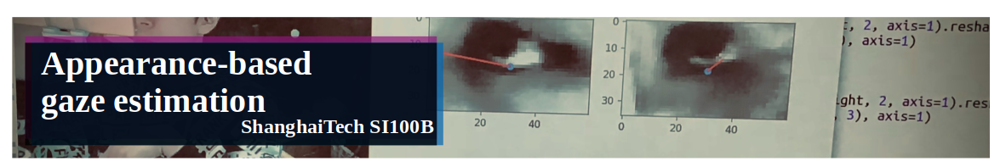
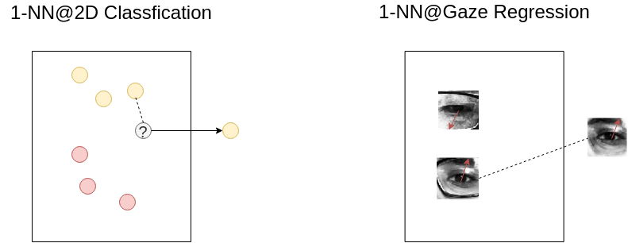
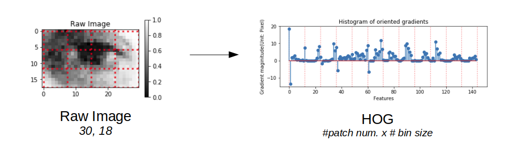

# SI100B Assignment 3 (Fall, 2021): Appearance-based Gaze Estimation


- Author: [Yintao Xu](xuyt@shanghaitech.edu.cn)
- Modified by: [Yucong Chen](chenyc@shanghaitech.edu.cn), [Yiwen Wu](wuyw1@shanghaitech.edu.cn)
- Proofread by: [Ziqi Gao](gaozq@shanghaitech.edu.cn)
- Update: 2021-11

This is a PBL (project-based learning) assignment for `numpy` and `pandas`. During constructing a model of gaze estimation, you would get to know knowledge about `numpy` and `pandas`.


## Introduction

Gaze tracking or gaze estimation is an important topic for understanding human visual attention. Such a technology has been widely deployed in various fields, such as human–computer interaction, visual behavior analysis, and psychological studies. Based on its huge potential value, many eye tracking devices (e.g., Tobii X3-120, Tobii EyeX, and Eye Tribe) have come into being. However, most of these devices are very expensive, making them hampered in wide adoption. Usually, **appearance-based gaze estimation employs a top-down strategy, which predicts the gaze direction or gaze point through eye images directly**. Such an approach is well established as another alternative for eye tracking since only achieving eye images is much cheaper. [1]


Many datasets are built to study this topic, including
- [ShanghaiTechGaze+](https://ieeexplore.ieee.org/document/8454246/authors#authors), a multi-view dataset with depth information;
- [MPIIGaze](https://www.mpi-inf.mpg.de/departments/computer-vision-and-machine-learning/research/gaze-based-human-computer-interaction/appearance-based-gaze-estimation-in-the-wild/), a dataset for estimating gaze direction;
- [GazeCapture](https://gazecapture.csail.mit.edu/), a large-scale(~1474 subjects) dataset on apple devices for estimating end-to-end position on device.


## Repository Structure

```
.
├── AppearanceGazeEst.py
├── dataset
│   ├── test.csv
│   ├── train.csv
│   ├── demo.jpeg
│   └── README.md
├── figures
│   └── ...
├── gazelib
│   ├── ...
│   └── utils
│       ├── ...
├── README.md (& README.pdf)
├── section_1&2_gaze_estimation.ipynb
└── section_bonus_gaze_estimation.ipynb
```

- `AppearanceGazeEst.py`: Your codes shall be written here.
- `dataset`: One Jupyter notebook will guide you to download data here.
- `figure`: All figures involved in this assignment are saved here.
- `gazelib`: All helper codes are saved here.
- `README.md`: This is what you are reading.
- `section_xxx_gaze_estimation.ipynb`: Those two Jupyter notebooks include step-by-step guidance to this assignment and provide local test for each function, following guides in notebook to write your code.

## Quick Start

This project relies on `pandas`, `numpy`, `Jupyter notebook`, `opencv`, `PIL`, `matplotlib`, etc. Solving the dependency issue is awkward. However, [anaconda](https://www.anaconda.com/) provides an elegant one-stage solution.

**First step**: Install [anaconda](https://www.anaconda.com/).

**Second step**: Open Jupyter notebook.

Start a console at root of repository, type in the command:

```zsh
➜ jupyter notebook
```

and you may see following output:

```zsh
...
[I 16:07:10.952 NotebookApp] Jupyter Notebook 6.1.4 is running at:
[I 16:07:10.952 NotebookApp] http://chenyc-node07:39297/
```

Normally, after starting a [Jupyter notebook](https://jupyter.org/), you will see a web page in browser below. Click `section_1&2_gaze_estimation.ipynb` to start your journey at this homework! Jupyter Notebook will provide you with an excellent interactive programming experience.

## Tasks introduction

There are two normal sections and one bonus section in total. Generally, you should follow guidelines at notebook and complete codes at  `AppearanceGazeEst.py`. You should pass the local test, which could largely guarantee that your final score at on-line judge.

### Section 1: Dataset with pandas (35 points)

In task one, you will be faced with **six questions of pandas** over gaze estimation dataset [MPIIGaze](https://www.mpi-inf.mpg.de/departments/computer-vision-and-machine-learning/research/gaze-based-human-computer-interaction/appearance-based-gaze-estimation-in-the-wild/). Relax! Each question will take you very few minutes.

Guidelines are in `section_1&2_gaze_estimation.ipynb`
- mean_of_tgt_subject (5 points)
- count_tgt_subject (5 points)
- get_min_val_of_tgt_col (5 points)
- compute_mean_eye (10 points)
- add_glasses_info (10 points)

### Section 2: KNN with numpy (35 points)

In Section 2, you would start from a naive "Eye Search Engine" to do `image2image` search. Then, convert it to a KNN model to estimate gaze direction.



Guidelines are in `section_1&2_gaze_estimation.ipynb`
- KNN_idxs (10 points)
- oneNN (10 points)
- KNN (15 points)


### Bonus Section: HOG with numpy (+35 points)

There is a widely accepted assumption in computer vision community: 
> local object appearance and shape can often be characterized rather well by **the distribution of local intensity gradients or edge directions**, even without precise knowledge of the corresponding gradient or edge positions.

Therefore, studying the **image gradient** is important. It is a directional change in the intensity or color in an image. 



Guidelines are in `section_bonus_gaze_estimation.ipynb`
- conv2d (10 points)
- compute_grad (10 points)
- bilinear_HOG (10 points)
- KNN_HOG (5 points)

## Submission

- **70+35** points for autolab grade and **30** points for on-site check, so **100+35** points in total.
- **ONLY** submit your `AppearanceGazeEst.py` to autolab, and **ONLY** the codes in that file will be graded.
- **ONLY** your last submission will be graded as your final grade.
- **DO NOT** change the file name and any function name in your  `AppearanceGazeEst.py`.
- **ZERO TOLERANCE** for plagiarism.

## Reference

```
[1] @ARTICLE{
    8454246, 
    author={D. {Lian} and L. {Hu} and W. {Luo} and Y. {Xu} and L. {Duan} and J. {Yu} and S. {Gao}}, 
    journal={IEEE Transactions on Neural Networks and Learning Systems}, 
    title={Multiview Multitask Gaze Estimation With Deep Convolutional Neural Networks}, 
    year={2019}, 
    volume={30}, 
    number={10}, 
    pages={3010-3023}, 
    keywords={computer vision;convolutional neural nets;estimation theory;gaze tracking;multiview cameras;multiview gaze tracking data;convolutional neural networks architecture;multiview multitask gaze point estimation solution;multiview eye images;gaze direction estimation;deep convolutional neural networks;Estimation;Gaze tracking;Head;Task analysis;Feature extraction;Cameras;Robustness;Convolutional neural networks (CNNs);gaze tracking;multitask learning (MTL);multiview learning}, 
    doi={10.1109/TNNLS.2018.2865525}, 
    ISSN={2162-2388}, 
    month={Oct},
}
    
[2] @inproceedings{zhang15_cvpr,
    Author = {Xucong Zhang and Yusuke Sugano and Mario Fritz and Bulling, Andreas},
    Title = {Appearance-based Gaze Estimation in the Wild},
    Booktitle = {Proc. of the IEEE Conference on Computer Vision and Pattern Recognition (CVPR)},
    Year = {2015},
    Month = {June}
    Pages = {4511-4520}
    }
```

